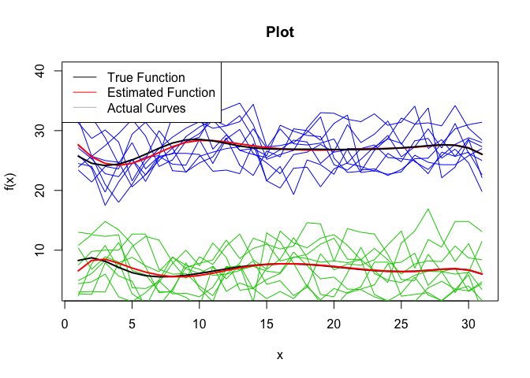

<!-- README.md is generated from README.Rmd. Please edit that file -->

# funclustVI

The following package was created by John Jewell as a part of my
Undergraduate Dissertation at Western University under the supervision
of Professor Camila de Souza. The package serves to cluster functional
data using variational inference. More details in regards to the
functionality of the package is available in the examples section.

<!-- badges: start -->

<!-- badges: end -->

## Installation

You can install the released version of funclustVI from
[CRAN](https://CRAN.R-project.org) with:

``` r
install.packages("funclustVI")
```

And the development version from [GitHub](https://github.com/) with:

``` r
 install.packages("devtools")
devtools::install_github("jewelltaylor/funclustVI")
```

## Usage

The funclustVI package offers two main functions: funclustVI and
simulate.

### funclustVI

The funclustVI function clusters functional data using a novel
variational inference based approach.

#### Arguments

  - **x**: A vector of values in which the functional data is evaluated
    over
  - **Y**: A matrix where each row represents a curve
  - **K**: The number of clusters among the curves
  - **true\_cluster\_assignments**: The actual cluster assignments for
    each curve
  - **init**: The initialization method for the cluster assignments
  - **nbasis**: The number of basis functions
  - **convergence\_threshold**: The threshold that determines when the
    model has converged
  - **max\_iterations**: The maximum amount of iterations for the
    algorithim
  - **gamma\_dist\_config\_matrix**: A matrix in which the first row is
    the alpha parameters for each cluster and the second row is the beta
    parameters for each cluster.
  - **verbose**: Parameter that determines whether or not to log output
    regarding model hyperparameters
  - **draw**: Parameter that determines whether or not to plot the real
    vs estimated curves after fitting the model
  - **plot\_params**: List of parameters corresponding to
    characteristics of the plot. Must include vectors xlim and ylim
    corresponding to the x and y limits of the plot. If NULL is
    supplied, plot function defaults are used. Must include boolean
    show\_curves. If true the actual curves are shown with diffent
    colors.

#### Return Value

The funclustVI function returns a list with the following entries:

  - **probability\_matrix**: A matrix in which the columns are the
    probabilities that the curves belong to that cluster
  - **cluster\_assignments**: A vector of intergers that represent the
    cluster assignment for each curve
  - **init\_cluster\_assignments**: The cluster assignments provided
    using the specified initlization method

### simulate

The simulate function generates data, fits a model and evaluates the
models predictions over a set number of iterations all using custom data
generation, modelling and evaluation parameters specified by the user.

#### Arguments

  - **data\_params**: List object containing the parameters required for
    generating the functional data and its characterics. Must include
    function named generate\_data that accepts the data params list and
    returns a matrix of curves in the rows. Must also include vector
    named true\_cluster\_assignments that contains the actual cluster
    assignments for each curve. Must also include vector named seeds
    that contains seeds the seed for each iteration of the simulation.
    Other then these requirements, anything can be included in the
    data\_params object.
  - **model\_params**: List object containing the parameters required
    for modelling the data and generating the cluster assignments. Must
    include function named model\_func that accepts Y, data\_params and
    model\_params and returns a vector containing the cluster assignment
    of each curve. Must also include list plot\_params as with the
    requirements as referenced above. Other then these requirements,
    anything can be included in the model\_params object.
  - **eval\_func\_list**: List object containing the functions
    corresponding to the various evaluations metrics evaluation the
    performance of the algorithim. Each function must accept a vector
    cluster\_assignments that is generated from the function model\_func
    in the model\_params list as well as the data\_params object which
    contains the vector true cluster assignments as referenced above.
  - **number\_of\_simulations**: The number of simulations
  - **save\_path**: The file path to save the results from the
    simualations. If NULL, the results are not saved.

#### Return Value

The simulate function returns a list with the following entries:

  - **result\_matrix**: The result matrix contains the values of each of
    the evaluation metric for each simulation in the simulations
  - **simulation\_length**: The length of the simuations in seconds

## Examples

This is an example which shows you how to use the package to generate
cluster assignments from functional data. Refer to above function
definitions above for detailed requirements.

``` r
#Import the funclustVI package 
library(funclustVI)

#Data Parameters 
x = seq(from=0,to=pi/3, length = 100)
curves_per_cluster = 10
data_params = list()
data_params$x = x 
data_params$curves_per_cluster = curves_per_cluster
Y = Case_7(data_params)
K = 3
true_cluster_assignments = rep(1:K,each = curves_per_cluster)

# Model Parameters 
init = "km"
nbasis = 6
convergence_threshold = 1
max_iterations = 10 
gamma_dist_config_matrix = matrix(0, 2, K)
gamma_dist_config_matrix[1, ] = c(78.125, 78.125, 78.125) * 100
gamma_dist_config_matrix[2, ] = c(12.5, 12.5, 12.5) * 100
verbose = FALSE
draw = FALSE
plot_params = list()
plot_params$xlim = NULL 
plot_params$ylim = c(1, 6)
plot_params$show_curves = FALSE 

#Fit the model
model = funcslustVI(x, Y, K, true_cluster_assignments, init, nbasis, convergence_threshold, max_iterations, gamma_dist_config_matrix, verbose, draw, plot_params)

#Get the cluster assignments
cluster_assignemnts = model$cluster_assignments

print(cluster_assignemnts)
#>  [1] 1 1 2 1 1 1 1 1 1 2 3 3 3 3 3 3 3 3 3 3 2 2 2 2 2 2 2 2 2 2
```

This is an example which shows how to use the funclustVI package to
cluster real data including in the package. The data corresponds to the
daily tempuratures in Vancouver and Toronto over the month of July over
the 10 year period 1994 to 2003. Since draw = Traw a plot is generated
showing the true function vs the estimated function for each cluster.
Since show\_curves is TRUE, the plot includes the actual curves with
differing colors. Refer to above function definitions above for detailed
requirements.

``` r
#Data Parameters
x = seq(1:31)
Y = dataset 
K = 2
curves_per_cluster = 9
true_cluster_assignments = rep(1:K,each = curves_per_cluster)

#Model Parameters 
init = "km"
nbasis = 10 
convergence_threshold = 1
max_iterations = 10 
gamma_dist_config_matrix = NULL 
verbose = FALSE
draw = TRUE
plot_params = list()
plot_params$xlim = NULL
plot_params$ylim = c(3, 40)
plot_params$show_curves = TRUE

#Fit the model 
model = funcslustVI(x, Y, K, true_cluster_assignments, init, nbasis, convergence_threshold, max_iterations, gamma_dist_config_matrix, verbose, draw, plot_params)
```



This is an example which shows how to run simulations. Refer to above
function definitions for detailed requirements.

``` r
library(funclustVI)

#Initializations
number_of_simulations = 1
save_path = NULL

#Data Parameters
x = seq(from=0,to=pi/3, length = 100)
K = 3
curves_per_cluster = 50 
true_cluster_assignments = rep(1:K,each = curves_per_cluster)
seeds = c(1:30)

#Pack into data parameter list
data_params = list()
data_params$x = x
data_params$K = K
data_params$curves_per_cluster = curves_per_cluster
data_params$true_cluster_assignments = true_cluster_assignments
data_params$seeds = seeds 
data_params$generate_data = Case_7

#Model Parameters
init = "km"
nbasis = 6
gamma_dist_config_matrix = matrix(0, 2, K)
gamma_dist_config_matrix[1, ] = c(78.125, 78.125, 78.125) * 5
gamma_dist_config_matrix[2, ] = c(12.5, 12.5, 12.5) * 5
convergence_threshold = 1
max_iterations = 10
verbose = FALSE
draw = FALSE

#Pack into model parameter list 
model_params = list()
model_params$model_func = get_funclustVI_cluster_assignments
model_params$init = "km"
model_params$nbasis = 6
model_params$gamma_dist_config_matrix = gamma_dist_config_matrix
model_params$convergence_threshold = convergence_threshold
model_params$max_iterations = max_iterations 
model_params$save_path = save_path
model_params$verbose = verbose
model_params$draw = draw
plot_params = list()
plot_params$xlim = NULL
plot_params$ylim = c(1, 6)
plot_params$show_curves = FALSE 
model_params$plot_params = plot_params

#Evaluation parameter list 
eval_func_list = list()
eval_func_list$mismatch = get_mismatches
eval_func_list$vmeasure = get_v_measure

#Run the simulations
simulate(data_params, model_params, eval_func_list, number_of_simulations, save_path)
#> seed  1 : mismatch  =  5  vmeasure  =  0.8996935  
#> Average  mismatch  =  5 
#> Average  vmeasure  =  0.8996935
#> $result_matrix
#>      [,1]      [,2]
#> [1,]    5 0.8996935
#> 
#> $simulation_length
#> Time difference of 10.03695 secs
#> 
#> $eval_metric_avg_vector
#> [1] 5.0000000 0.8996935
```
