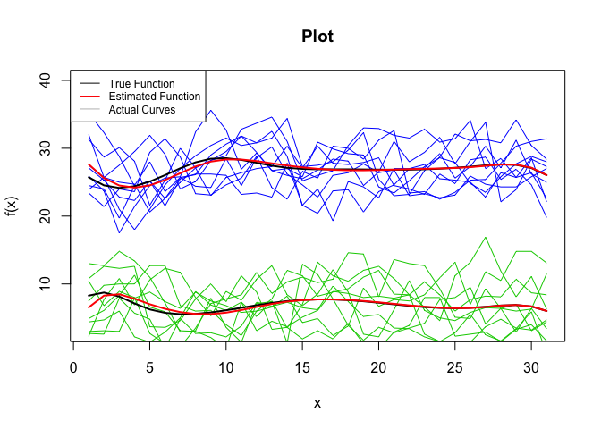
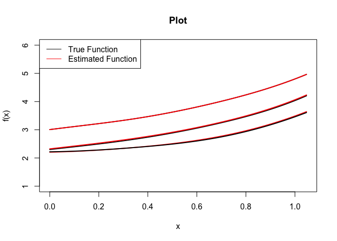

<!-- README.md is generated from README.Rmd. Please edit that file -->

# funclustVI

The following package was created by John Jewell as a part of my
Undergraduate Dissertation at Western University under the supervision
of Professor Camila de Souza. The package serves to cluster functional
data using variational inference. More details in regards to the
functionality of the package is available in the examples section.

<!-- badges: start -->

<!-- badges: end -->

## Installation

You can install the released version of funclustVI from
[CRAN](https://CRAN.R-project.org) with:

``` r
install.packages("funclustVI")
```

And the development version from [GitHub](https://github.com/) with:

``` r
# install.packages("devtools")
devtools::install_github("jewelltaylor/funclustVI")
```

## Example

This is an example which shows you how to use the package to generate
cluster assignments from functional data.

``` r
#Import the funclustVI library  
library(funclustVI)

#Data Arguments


# Model Arguments 
x = seq(from=0,to=pi/3, length = 100)
curves_per_cluster = 10
data_params = list()
data_params$x = x 
data_params$curves_per_cluster = curves_per_cluster
Y = Case_7(data_params)
K = 3 
init = "km"
nbasis = 6
true_cluster_assignments = rep(1:K,each = curves_per_cluster)
gamma_dist_config_matrix = matrix(0, 2, K)
gamma_dist_config_matrix[1, ] = c(78.125, 78.125, 78.125) * 100
gamma_dist_config_matrix[2, ] = c(12.5, 12.5, 12.5) * 100
convergence_threshold = 1
verbose = FALSE
draw = FALSE
plot_params = c(1, 6)

model = funcslustVI(Y, x, K, init, nbasis, convergence_threshold, gamma_dist_config_matrix, true_cluster_assignments, verbose, draw, plot_params)

cluster_assignemnts = model$cluster_assignments

print(cluster_assignemnts)
#>  [1] 3 2 2 2 3 2 2 2 2 2 1 1 3 1 1 3 3 1 3 1 2 2 2 2 2 2 2 2 2 2
```

This is an example which shows how to use the funclustVI package to
cluster real data including in the package. The data corresponds to the
daily tempuratures in Vancouver and Toronto over the month of July over
the 10 year period 1994 to 2003.

``` r
x = seq(1:31)
curves_per_cluster = 9
K = 2
nbasis = 10 
init = "km"
nbasis = 10
convergence_threshold = 1
gamma_dist_config_matrix = NULL 
true_cluster_assignments = rep(1:K,each = curves_per_cluster)
verbose = FALSE
draw = TRUE
plot_params = c(3, 40)

model = funcslustVI(dataset, x, K, init, nbasis, convergence_threshold, gamma_dist_config_matrix, true_cluster_assignments, verbose, draw, plot_params)
```



This is an example which shows how to run simulations. Since draw =
True, a plot is generated showing the true vs estimated functions.

``` r
#Initializations
x = seq(from=0,to=pi/3, length = 100)
number_of_simulations = 1

curves_per_cluster = 50
K = 3
init = "km"
nbasis = 6
true_cluster_assignments = rep(1:K,each = curves_per_cluster)
gamma_dist_config_matrix = matrix(0, 2, K)
gamma_dist_config_matrix[1, ] = c(78.125, 78.125, 78.125) * 100
gamma_dist_config_matrix[2, ] = c(12.5, 12.5, 12.5) * 100
convergence_threshold = 1
save_path = NULL
verbose = FALSE
draw = TRUE

data_params = list()
model_params = list()
eval_func_list = list()

data_params$x = x
data_params$K = K
data_params$curves_per_cluster = curves_per_cluster
data_params$true_cluster_assignments = true_cluster_assignments
data_params$generate_data = Case_7

model_params$model_func = get_funclustVI_cluster_assignments
model_params$init = init
model_params$nbasis = nbasis
model_params$gamma_dist_config_matrix = gamma_dist_config_matrix
model_params$convergence_threshold = convergence_threshold
model_params$save_path = save_path
model_params$verbose = verbose
model_params$draw = draw
model_params$plot_params = c(1, 6)

eval_func_list$mismatch = get_mismatches
eval_func_list$vmeasure = get_v_measure

eval_func_param_list = NULL

run_simulations(data_params, model_params, eval_func_list, number_of_simulations, save_path)
```



    #> mismatch  =  5 
    #> vmeasure  =  0.8996935 
    #> Average  mismatch  =  5 
    #> Average  vmeasure  =  0.8996935
    #>      [,1]      [,2]
    #> [1,]    5 0.8996935
